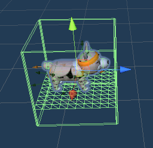
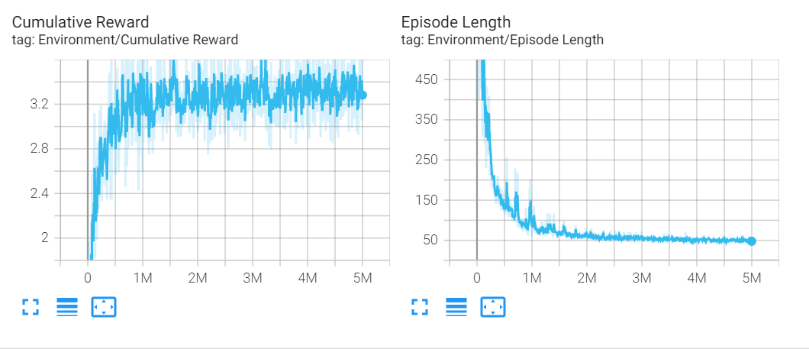

# wARphago

## Summary.

기계학습으로 움직이는 강아지가 AR상에 돌아다닌다 ? ! 

<br/>

```
WAR(왈!) + AR + ALPHAGO !
```


<br/>

### 돌보기 

|||
| :-: | :-: |

강아지를 돌보는 공간으로 휴식, 밥주기와 쓰다듬기를 통해서 배고픔, 체력, 애정도 수치를 관리할 수 있다. 이 수치는 시간에 따라 수치가 감소하며, 일정 수치 이하에서는 페널티가 존재한다. 

상하단의 버튼들을 통하여 강아지와 여러가지 게임을 할 수 있다.

<br/>

### 막대기 물어오기


유저가 나무 막대기를 던지고, 강아지가 이 막대기를 물어오게 하는 게임.

막대기는 좌우로 스와이프 하여 방향을 조절할 수 있다.

<br/>

### 산책


강아지와 함께 산책을 하면서 산책로에 배치된 선물 상자를 획득하는 게임.

상자를 많이 얻을수록 많은 보상을 얻을 수 있지만, 함정 상자도 있어서 조심해야 한다.

손잡이를 끌어서 강아지의 경로를 조정할 수 있지만, 강아지가 뜻대로만 움직이지는 않을 것이다.

<br/>

### AR 기능 


강아지와 AR 기능을 통해서 현실세계에 불러오는 기능.

휴대폰의 카메라 기능으로 주변 환경을 인지하고, 인식된 바닥 위에서 강아지를 뛰어다니게 할 수 있다.

바닥에 표시된 마커를 따라서 강아지가 이동하며, 너무 빠르게 이동할 경우에는 강아지가 따라오지 못할 수도 있다.

<br/>

## Implementation.

<br/>

### Backend
- Firebase Unity SDK 사용

<br/>

**Authentication**
- 유효하는 이메일 주소와 비밀번호를 사용하여 UID를 자동생성하고, 이 UID를 이용해 데이터베이스에 접근할 수 있다
- 사용자 이메일, 비밀번호, 게임 내에서 사용 될 닉네임을 받아서 회원가입 진행하였다

<br/>

**Realtime Database**
- name, affection, health, hungry, time(가장 최근 접속 시간)을 실시간 데이터베이스에 저장하였다
- 산책, 막대기 던지기 게임, 밥 먹기 등을 통해 체력이 소모되거나 애정도가 변화하면 실시간으로 데이터베이스에 동기화된다
- coroutine을 이용하여 게임에 접속 해있는 동안 10초를 주기로 affection, hungry가 감소, health가 증가되도록 하였다

<br/>

### Frontend & AR

<br/>

**AR**
- Unity 2019.4.34f1
- Unity AR Foundation 4.1.9
- [참고자료](https://codelabs.developers.google.com/arcore-unity-ar-foundation)

<br/>




Unity's AR Foundation에서 제공하는 기능을 활용하여 움직임을 머신러닝을 통해 학습시킨 강아지를 AR 환경에 띄웠다. 강아지가 주어진 타겟을 향하도록 학습이 되어 이를 바로 환경에 바로 적용할 수 없었고, 강아지의 움직임을 특정한 공간에 제한시키고, 공간 자체를 이동시키는 방식으로 해결하였다.  

<br/>

### Machine Learning

- Unity 2019.4.34f1
- [Unity ml-Agent](https://github.com/Unity-Technologies/ml-agents) 1.0.8

기존에 Unity에서 발표한 [*Puppo the Corgi*](https://blogs.unity3d.com/2018/10/02/puppo-the-corgi-cuteness-overload-with-the-unity-ml-agents-toolkit/)를 ml-agent 1.0.8 버전에 맞게 코드를 수정하여 강아지의 움직임을 다시 학습하였다.
hyper parameter는 이전 학습에서 사용하였던 값을 이용하였고, 약 2시간 정도 학습을 진행하였다.



<br/>

## Made By.

[KAIST 전산학부 19학번 강현희](https://github.com/presenthee)

[고려대학교 컴퓨터학과 19학번 최윤지](https://github.com/yunz0926)

[KAIST 전산학부 17학번 권기훈](https://www.github.com/kyoonkwon)